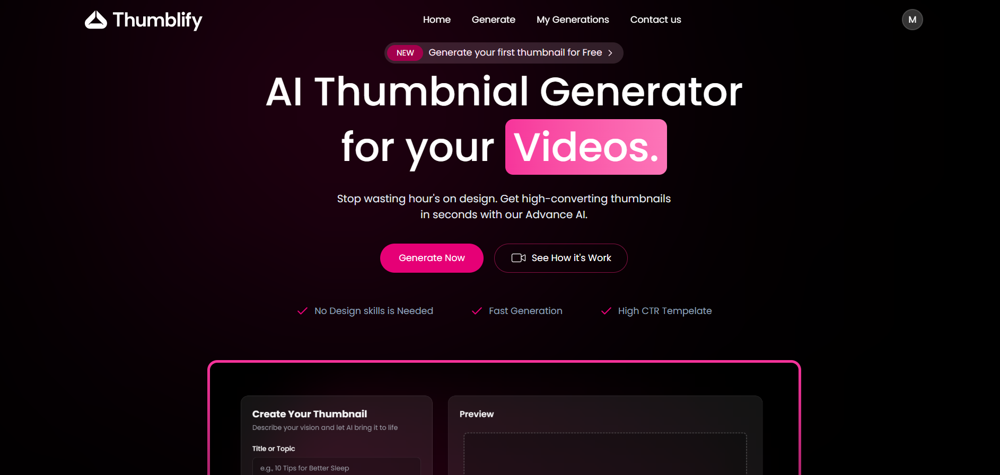
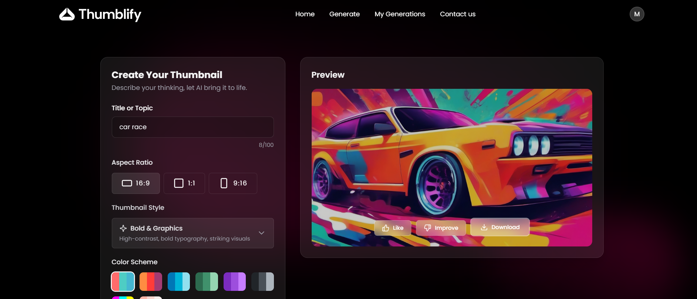
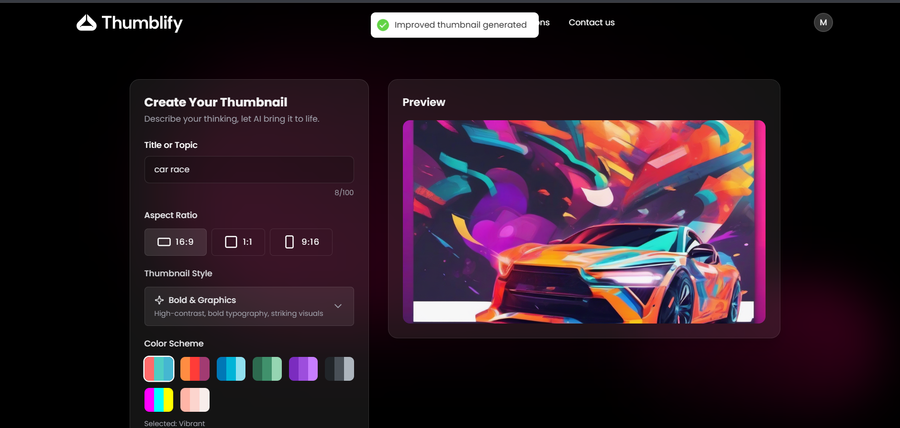

# AI Thumbnail Generator with like and dislike options

A full-stack AI-powered web application that generates thumbnails and continuously improves them
based on user feedback (like / dislike) until the user is satisfied.

---

## 🚀 How It Works

1. User requests a thumbnail
2. AI generates a thumbnail using Hugging Face
3. User clicks **Like** or **Dislike**
4. If **Liked** → thumbnail is accepted
5. If **Disliked** → AI regenerates an improved thumbnail
6. Process repeats until the user likes the result

---

## ✨ Features

- AI-based thumbnail generation
- Like / Dislike feedback loop
- Automatic thumbnail improvement
- Hugging Face inference integration
- Modern and responsive UI

---

## 🛠 Tech Stack

- React + Vite
- TypeScript
- Node.js + Express
- Hugging Face Inference API
- Git & GitHub

---
 📁 Project Structure
```
├── public
├── src
│ ├── components # UI components
│ ├── pages # Application pages
│ ├── context # Global state management
│ ├── services # API calls
│ └── utils # Helper functions
├── server
│ ├── controllers # Request handling logic
│ ├── routes # API routes
│ ├── services # AI & business logic
│ └── config # Environment & setup
├── package.json
└── README.md
```
## 📸 AI Thumbnail Improvement Demo

### 🏠 Home Page
This is the main landing page of the application where users can start generating AI-based thumbnails.



---

### 🖼️ Initial AI-Generated Thumbnail
This thumbnail is generated by the AI based on the user’s input before any feedback is provided.



---

### 🔄 Improved Thumbnail After Dislike
When the user clicks **Dislike**, the system uses the feedback to regenerate and improve the thumbnail automatically.


